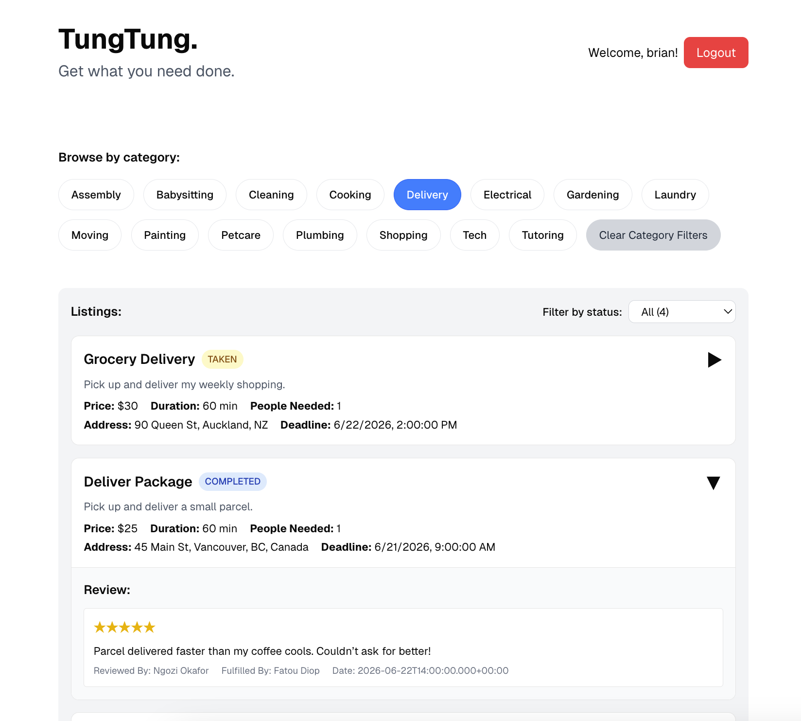

# Welcome to `TungTung`
Like Uber, but for services — use our website to make a post asking for a plumber to fix your pipes, a gardener to de-weed your garden, or a math tutor to help you with your midterm prep!

<!--  -->


## Sample Dataset
The dataset will be entirely populated by users. See below for how to set up the database with our sample dataset.

## Dependencies
- Java 17 SDK
- Next.js 15.3
- MySQL

On VSCode:
- Java Extension Pack
- Spring Boot Extension Pack

## Installation Instructions
In the future, this app will be dockerized for a streamlined experience. For now, we will use manual configuration.

First, install the dependecies above. Then, clone the repo:
```
git clone https://github.com/pahu2353/tungtung.git
cd TungTung
```

## Initializing Backend

First, `cd backend`. Then, create the sample database and tables by running `sample-dataset.sql` in `backend/src/schema`

Configure credentials in `backend/src/main/resources/application.properties` as follows:
```
spring.application.name=TungTung
spring.datasource.url=jdbc:mysql://localhost:3306/TungTung?useSSL=false&serverTimezone=UTC
spring.datasource.username=[YOUR_USERNAME]
spring.datasource.password=[YOUR_PASSWORD]
spring.datasource.driver-class-name=com.mysql.cj.jdbc.Driver
```

Lastly, run `./mvnw clean spring-boot:run` in backend. These endpoints should be accessible:

```
GET  localhost:8080/hello
GET  localhost:8080/taskcategories
GET  localhost:8080/listings
GET  localhost:8080/listings/filter
GET  localhost:8080/listings/{listingId}/reviews
GET  localhost:8080/users/{uid}/name
GET  localhost:8080/db/seed

POST localhost:8080/signup
POST localhost:8080/login
```

## Accessing the Production Database

The production database has already been generated using JavaFaker to create realistic synthetic data, including user accounts, service listings, categories, assignments, and reviews. To load the production dataset into your database, simply run the following command:

```bash
mysql -u [YOUR_USERNAME] -p < backend/src/schema/production.sql
```

This scalable approach allows us to control the volume and complexity of the data by adjusting parameters, simulating diverse user behaviors and service demands.

## Initializing Frontend

Steps:

1. `cd frontend`
2. `npm install`
3. `npm run dev`

After this `localhost:3000` should open on your browser.

NOTE: Please make sure that the backend is running before running the frontend.


## Features Implemented

### Feature 1: Account Creation and Login
Users are able to create accounts and log in.

- **Backend**
  - File: `backend/src/main/java/com/tungtung/hello/M1Controller.java`
  - Endpoints:
    - `@PostMapping("/signup")`
    - `@PostMapping("/login")`
- **Frontend**
  - File: `frontend/app/page.tsx`
  - Functions:
    - `handleAuth`
    - `handleLogout`
    - `fetchUserName`

---

### Feature 2: Listing All Categories
Displays a list of all available service categories.

- **Backend**
  - File: `backend/src/main/java/com/tungtung/hello/M1Controller.java`
  - Endpoint:
    - `@GetMapping("/taskcategories")`
- **Frontend**
  - File: `frontend/app/page.tsx`
  - Function:
    - `handleGetTaskCategories`

---

### Feature 3: Category Filter for Listings
Users can click categories to filter the listings. Multiple category selections will display only listings that match **all** selected categories.

- **Backend**
  - File: `backend/src/main/java/com/tungtung/hello/M1Controller.java`
  - Endpoint:
    - `@GetMapping("/listings/filter")`
- **Frontend**
  - File: `frontend/app/page.tsx`
  - Function:
    - `toggleCategory`
